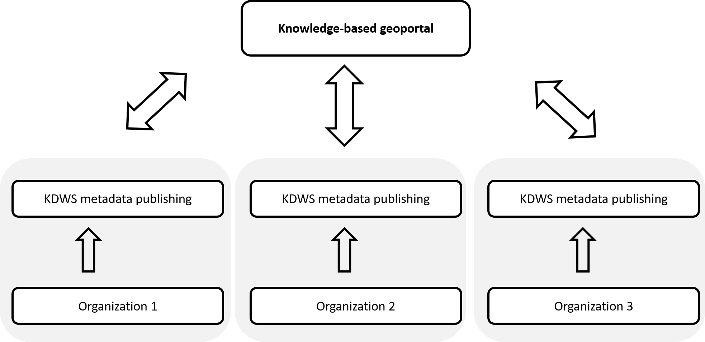

# Paper Title

    1. Developing a knowledge-based geoportal

    1. Towards a Data Mining Based Geoportals in Spatial Data Infrustructure

    knowledge-based geoportal in spatial data infrustructure

## introduction

blablabla

## KDWS Metadata publishing

Metadata is data that provides information about data but not the content of the data. In a knowledge-based Geoportal we should record information about the data, services, availabale data minig algorithms and other potential resources. It allows for the publishing and discovery of KDWS metadata via HTTP.

We use a kinds of catalogue service for saving records that describe  data, KDWS functionality and related resources. It defines common interfaces to discover potential resources in the service. The records maintain in organization databases that accessed and managed by a RESTful API. This API  implemented in server-side and written in Python.

Common Dublin Core, ISO 19139 and FGDC metadatacore core fields used in our metadata profiles implementation.

KDWS Metadata core fields:

    Organization information (TODO describe)
    Suported operations (TODO describe)
    Entity and attribute information (TODO describe)
    Distribution information (TODO describe)

Also we provide an admin utility for addig, update and deliting KDWS metadata.
