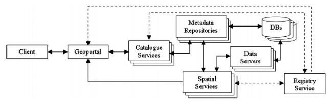
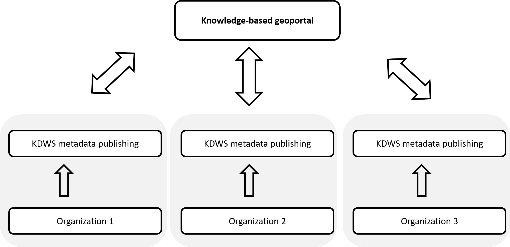
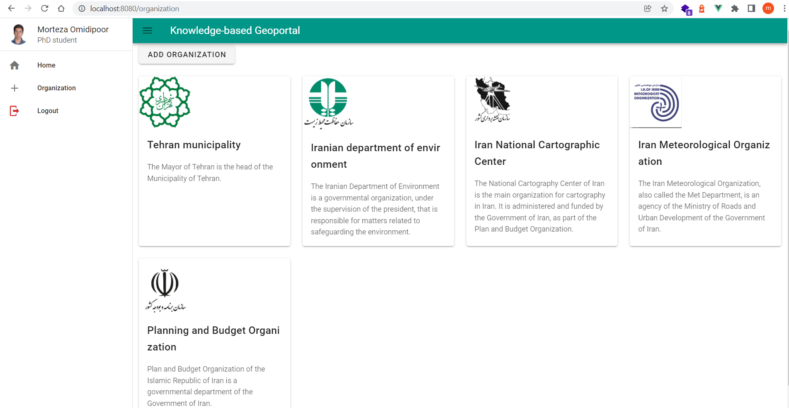
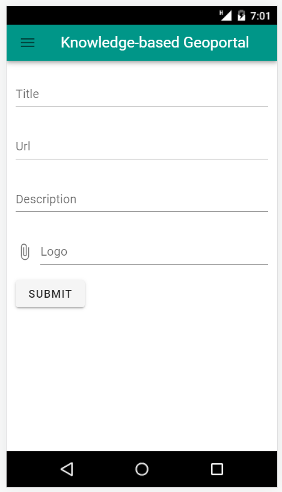

# **Evolution of Geoportal: Discovering, Extracting And Sharing Knowledge From Spatial Data Infrustructure**

## Introduction

Over the past few decades, the use of geospatial information in decision making has reached a very important role, and several organizations have generated a large amount of geospatial data using different sources [1]. To overcome different  challenges in spatial data handling, Spatial Data Infrastructure (SDI) has been emerged [6]. SDIs focused on storing, discovering, and sharing raw spatial data to assist user groups of various public and private organizations [2].

The concept of geoportals has emerged as one of the key technological solutions for improving the efficiency and effectiveness of geospatial activities [5]. A geoportal allows data consumers to access, search and discover geospatial data and enables data producers to publish and share geospatial data. Furthermore, this online infrastructure may provide other geographic information services such as data visualization, editing, and analysis to its various stakeholders [1,2].
Geoportal has a pivotal role in SDI, since it provides an entry point to spatial data on the web with standardized and more appropriate ways of searching for and accessing spatial data [8].
Although the primary purpose of developing geoportals was not to address issues related to data analysis or knowledge extraction, in recent years the need to facilitate analytical, statistical capabilities or knowledge extraction methods in geoportals has been raised in some studies [3,9,10,11]. Besides, growing availability of spatial data from SDIs offer great possibilities for exteracting valuable knowledge from SDIs [4]. However, Extracting high-level information and knowledge from spatial datasets is a classic problem in geographic information system (GIS) and society [7]. Although SDI is well suited for distributed data-driven accessing and sharing spatial data, it is not yet adapted for knowledge extraction in an interoperable environment [3].

Extracting knowledge from distributed SDIs data based on Geoportals provide  a bright vision for spatia data communities. In order to search, extracting and sharing knowledge by using a geoportal, the capabilities of Knowledge Discovery Web Service (KDWS) in Spatial Data Infrastructures  can be used [4] as a layer on top of the SDIs to provide spatial data users and decision-makers with the possibility of extracting knowledge from massive heterogeneous spatial data in SDIs [3].

The central thesis of this paper is that a geoportal can be used for knowledge discovery, extraction, and sharing in SDI ecosystem. The remaining part of the paper proceeds as follows: First, theoretical dimensions of the research addressed (See sec.#). In sec.# methods employed for the developed geoportal described in detail. In sect.# implementation steps of proposed Geoportal include #, #, #, # outlined. Finally in sec.5 and sec.6 properties of developed method discussed and conclusions provided.

## Background

### Spatial Data Infrastructure (SDI) and Geoportal
Historically, the term SDI has been used to describe technological infrastructures, standards, services, policies, actors(human resources), and related activities necessary to maintain, distribute, access and delivery(sharing) of geospatial information  in different communities [multi ref]. The SDI concept has emerged as a result of the increasing numbers of multiparticipant environments in decision making, which highlights the need to reorganize data across different disciplines and organizations [13]. Generally, SDI is built upon a geospatial data community with different components and hierarchical structure (local, national, regional and global scales).

Sharing spatial data between other communities need a distributed network. The method used to set up such networks depends on various technological, legal, organizational, cultural, commercial and managerial contexts. Despite its common usage, different terms include "Spatial Data Clearinghouse", "Catalog Service", and "Spatial Data Directory"  used in in different countries to name this type of network. In addition to infrastructure, details of spatial data and services need to be properly described. This description information, known as metadata, is organized based on the standard formats. Dublin Core [14], Federal Geographic Data Committee (FGDC) standard [17], ISO 19139 [15], ISO 19115 [16], and INSPIRE metadata [18] are the most well-known standards used in this context.

The early generation of clearinghouses provided users with either information about the data, or a link to the data producer web site and hints for accessing the data [6]. The development of technology and the advancement of spatial web services set up a new generation of clearinghouses that are based on Geoportals as a gateway. Geoportal can broadly be defined as web-based portal used to discovering and accessing spatial data and services. One reason why Geoportal is important is that it provide a single and integrated environment to acessing all available spatial resources.

According to Toomanian [6] reviewed the basic components of current clearinghouse networks (See Figure#).



As Figure[#] shown, data producers publish and store metadata by using catalog service metadata repository respectively.Here geoportal acts as a gateway, to deliver desired data according to user preferences, the geoportal explores metadata repositories through catalog services. If requested data is available and related data servers provide spatial services, required resource shared with the user. To be discoverable by a geoportal, spatial services and catalog services are registered by registry services.

According to Smith [13], lack of knowledge and experience, and limited insight in the benefits are the most important chalanges in SDIs.

## Methodology
The proposed geoportal integrates the capabilities of KDWS into classical geoportal to provide extracting knowledge from distributed SDIs.

### KDWS
There are relatively few historical studies in the area of discovering, extracting and sharing Knowledge from SDIs based on geoportals.


KDWS is used for discovering and retrieving spatial knowledge from SDIs. The origin idea is the same as OGC Catalogue Service for the Web (CSW) specificaton. However, KDWS Implementation focused on publishing metadata as well as discovering and retrieving knowledge from distributed SDIs. To discovering and retrieving knowledge from distributed SDIs the KDWS defines several possible operations (Figure.#). These operations implemented based on OGC Web Services Common Standard (OWS) [12].

```xml
<ows:OperationsMetadata>
    <ows:Operation name="GetCapabilities"></ows:Operation>
    <ows:Operation name="GetInsight"></ows:Operation>
    <ows:Operation name="GetSpatialClusters"></ows:Operation>
    <ows:Operation name="GetSpatialClassification"></ows:Operation>
    <ows:Operation name="GetSpatialAssociationRules"></ows:Operation>
</ows:OperationsMetadata>
```
As Fig# shows that KDWS inherits GetCapabilities operation from the OWS interface and adds three operations named GetInsight, GetSpatialClusters, GetSpatialClassification, and GetSpatialAssociationRules. The GetCapabilities operation allows any client to retrieve capabilities provided by any organization that implements an KDWS  implementation specification.

A full discussion of KDWS lies beyond the scope of this study.


### Proposed Architecture

### KDWS Metadata publishing

Metadata is data that provides information about data but not the content of the data. In a knowledge-based Geoportal we should record information about the data, services, availabale data minig algorithms and other potential resources. It allows for the publishing and discovery of KDWS metadata via HTTP.

We use a kinds of catalogue service for saving records that describe  data, KDWS functionality and related resources. It defines common interfaces to discover potential resources in the service. The records maintain in organization databases that accessed and managed by a RESTful API. This API  implemented in server-side and written in Python.

Common Dublin Core, ISO 19139 and FGDC metadatacore core fields used in our metadata profiles implementation.

KDWS Metadata core fields:

    Organization information (TODO describe)
    Suported operations (TODO describe)
    Entity and attribute information (TODO describe)
    Distribution information (TODO describe)



Also we provide an admin utility for addig, update and deliting KDWS metadata.

### Prototype Implementation
Each organization registers its own service (KDWS) in the management panel.

admin panel of geoportal (show registered organization)


admin panel of geoportal (create new organization)


## Results

## Discussion and Conclusions
discuse solutions are compliant with OGC Standards

## Refrences

1. [The Americas’ Spatial Data Infrastructure](https://www.mdpi.com/2220-9964/8/10/432/htm)
2. [From Spatial Data Infrastructures to Data Spaces—A Technological Perspective on the Evolution of European SDIs](https://www.mdpi.com/2220-9964/9/3/176)
3. [Knowledge Discovery Web Service for Spatial Data Infrastructures](https://www.mdpi.com/2220-9964/10/1/12)
4. [Towards the Semantic Enrichment of Trajectories Using Spatial Data Infrastructures](https://www.mdpi.com/2220-9964/10/12/825/htm)
5. [Open Community-Based Crowdsourcing Geoportal for Earth Observation Products: A Model Design and Prototype Implementation](https://www.mdpi.com/2220-9964/10/1/24/htm)
6. [Methods to Improve and Evaluate Spatial Data Infrastructures](https://lucris.lub.lu.se/ws/portalfiles/portal/5908447/2440815.pdf)
7. [Towards Spatial Knowledge Infrastructure (SKI): Technological](https://agile-online.org/conference_paper/cds/agile_2018/shortpapers/89%20AGILE_2018_Rivised%20Paper.pdf)
8. [Expert system to enhance the functionality of clearinghouse services](https://www.sciencedirect.com/science/article/pii/S0198971510000621)
9. [Bridging open source tools and Geoportals for interactive spatial data analytics](https://www.tandfonline.com/doi/full/10.1080/10095020.2019.1645497)
10. [The statistical geoportal and the ``cartographic added value'' - creation of the spatial knowledge infrastructure](https://www.researchgate.net/publication/258646417_The_statistical_geoportal_and_the_cartographic_added_value''_-_creation_of_the_spatial_knowledge_infrastructure)
11. [CoGIS - A knowledge geoportal for a knowledge society](http://www.saeon.ac.za/enewsleter-archives/2009/july-2009/cogis-a-knowledge-geoportal-for-a-knowledge-society)
12. [OGC Web Services Common Standard](https://www.ogc.org/standards/common)
13. [Modeling and improving Spatial Data Infrastructure (SDI)](https://portal.research.lu.se/en/publications/modeling-and-improving-spatial-data-infrastructure-sdi)
14. [Dublin Core](https://en.wikipedia.org/wiki/Dublin_Core)
15. [SO/TS 19139:2007](https://www.iso.org/sites/outage/)
16. [ISO/TS 19115:2003](https://www.iso.org/sites/outage/)
17. [CONTENT STANDARD FOR DIGITAL GEOSPATIAL METADATA (CSDGM)](https://www.fgdc.gov/metadata/csdgm-standard)
18. [INSPIRE Metadata](https://inspire.ec.europa.eu/metadata/6541)
